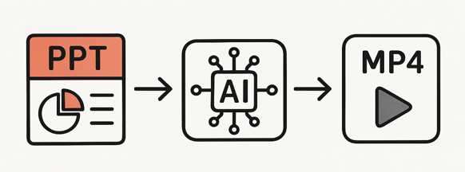
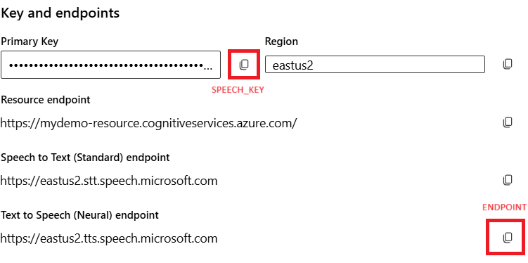

# Generate Movie from PowerPoint

Automatically convert PowerPoint presentations into professional videos with high-quality AI narration using Azure Speech Services.



<details>
<summary><h2>🎬 View demo</h2></summary>

Here's an example of what the tool generates - a short test video created from a simple PowerPoint slide:

https://github.com/user-attachments/assets/af3002bc-d814-47d7-bd7d-f0557fefc782

> You can create this video yourself with the default .env values

</details>

## 🚀 Quick Start

### Get a speech endpoint and key

This process uses Azure AI Foundry to produce narration for you.  To get the endpoint and key:

1. Create or open a Foundry project. (No need to deploy a model, the new project type already has the speech capability built in.)
1. Go to **Overview > View all endpoints > Service endpoints > Azure AI Speech**.   You'll use the key and endpoint in your `.env` file in the instructions below.



### Prepare your Powerpoint

- Open your PowerPoint file
- Add narration text to the **Notes** section of each slide
- Save the presentation

### Option 1: GitHub Codespaces
<details>
<summary>View instructions for GitHub Codespaces</summary>

[](https://codespaces.new/sdgilley/generate_movie)

#### ⚠️ Important: Manual Slide Export Required in Codespaces

Due to Linux limitations, automatic slide export may only capture text. For full slide visuals, follow these steps:

1. **Export your slides as PNG images from PowerPoint:**
   - Open your presentation in PowerPoint (Windows or macOS)
   - Go to `File > Export > Change File Type > PNG Portable Network Graphics Format`
   - Click `Save As`, choose a folder (e.g., `exported_slides`)
   - When prompted, select `All Slides`
   - This will create individual PNG files for each slide
1. **Upload all PNG files to the `exported_slides/` folder in your Codespace**
1. **Configure .env file**

   - Copy .env.example to .env
   - Add your values for the SPEECH_KEY, ENDPOINT, and POWERPOINT_FILE. (use the endpoint for tts)

1. **Generate your video**: Use Ctrl+Shift+P → "Tasks: Run Task" → "Convert PowerPoint to Video"
1. Delete the files in `uploaded_slides/` when you're done so they won't be used for a new project in the codespace.

**Note:** The code will automatically use the PNGs in `uploaded_slides/` if present and will not attempt to generate slides from text. If no PNGs are found, it will fall back to text-only images.

</details>

### Option 2: Local Development

<details>
<summary>View instructions for local development</summary>

1. **Create and activate a virtual environment:**

   ```bash
   # Create virtual environment
   python -m venv venv
   
   # Activate virtual environment
   # On Windows:
   venv\Scripts\activate
   # On macOS/Linux:
   source venv/bin/activate
   ```

1. **Install dependencies:**

   ```bash
   pip install -r requirements.txt
   ```

1. **Install additional system dependencies (macOS only):**

   ```bash
   # Install LibreOffice for PowerPoint conversion
   brew install --cask libreoffice
   
   # Install ImageMagick for image processing
   brew install imagemagick
   
   # Install Ghostscript (required for ImageMagick PDF processing)
   brew install ghostscript
   ```

1. **Configure .env file**

   - Copy .env.example to .env
   - Add your values for the SPEECH_KEY, ENDPOINT, and POWERPOINT_FILE. (use the endpoint for tts)


1. **Generate your video:**

   ```bash
   python generate_with_azure_audio.py
   ```

</details>

## Project Structure

- generate_with_azure_audio.py - Main script for video generation
- generate_from_slides.py - Export slides from PowerPoint
- requirements.txt - Python dependencies
- content_maintenance_process.pptx - Example PowerPoint file


## How It Works

1. **Slide Export** - Extracts slides from PowerPoint as high-resolution images
1. **Narration Extraction** - Reads narration text from slide notes
1. **Audio Generation** - Creates natural speech using Azure Speech Services
1. **Video Assembly** - Combines slides with audio using optimal timing:
   - Slide appears immediately
   - reading pause at beginning of each slide (configure in .env file, default 1.5 sec)
   - Narration plays while slide remains visible
   - Smooth transition to next slide

## Requirements

- Python 3.7+
- Azure AI Foundry project
- PowerPoint (for slide export)
- See requirements.txt for Python packages

## Troubleshooting

- run `python test/test_voice.py` to make sure your `.env` settings work
- run `python test/find_voice.py` to get a list of all the possible voices you could use

## Contributing

Feel free to submit issues and enhancement requests!

## License

This project is open source and available under the MIT License.
